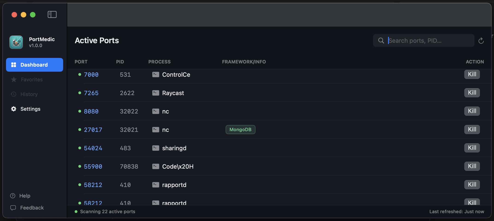

# PortMedic

[](https://github.com/bansikah22/PortMedic/actions/workflows/ci.yml)
[](LICENSE)
[](#requirements)

The fastest way to free a busy development port on macOS.

PortMedic is a lightweight, native macOS utility that lists every process
listening on a network port and lets you terminate it with a single click.
It replaces the repetitive `lsof -i :8080` / `kill -9 <PID>` terminal workflow
that developers run countless times a week.



## Why

Local development constantly leaves ports occupied by crashed or orphaned
processes:

```
Address already in use — port 8080 is already occupied.
```

Resolving this normally means leaving your editor, finding the process,
copying its PID, killing it, and switching back. PortMedic collapses that
into one click, without opening a terminal or a heavyweight IDE plugin.

## Features

- Lists all active listening ports with their PID, process name and protocol.
- One-click termination with a confirmation prompt.
- Search across port, PID, process name, user and detected framework.
- Automatic framework detection, so a port shows "PostgreSQL" or "Next.js"
  instead of a generic `docker` or `node`.
- Process detail panel with executable path, working directory, user and
  protocol.
- Menu bar extra for checking and refreshing ports without opening the window.
- Configurable auto-refresh interval and launch-at-login.

### Framework detection

PortMedic recognises common development services by port and process name:

| Detected            | Matched by                    |
| ------------------- | ----------------------------- |
| Next.js / Node.js   | `node` process (port 3000)    |
| Vite Dev Server     | port 5173                     |
| Spring Boot         | `java` process                |
| PostgreSQL          | port 5432                     |
| MySQL               | port 3306                     |
| Redis               | port 6379                     |
| MongoDB             | port 27017                    |
| Docker              | `docker` process              |
| Python              | `python` process              |

Port matches take precedence over process-name matches, so a Postgres
container reporting as `docker` is still labelled "PostgreSQL" and is
findable by searching `postgres`.

## Footprint

PortMedic is built to stay out of the way. Measured on a release build:

| Metric                  | Value    |
| ----------------------- | -------- |
| Application bundle      | 4 MB     |
| Resident memory         | ~80 MB   |
| CPU while idle          | 0.0%     |

There is no bundled runtime, no embedded browser and no background daemon.
Polling is suspended automatically whenever PortMedic is not the active
application, scan results are only republished when something actually
changed, and framework detection is resolved once per scan rather than on
every redraw. The result is a utility that costs effectively nothing to leave
running all day.

## Requirements

- macOS 15.5 or later
- Xcode 16.4 or later (to build from source)

## Installation

### Download a release

Download `PortMedic-X.Y.Z.dmg` from the [Releases page](https://github.com/bansikah22/PortMedic/releases),
open it, and drag `PortMedic.app` into `Applications`.

Release builds are ad-hoc signed (not by an Apple Developer ID) and not
notarised, since that requires a paid Apple Developer Program membership. On
first launch macOS Gatekeeper may still refuse to open the app with an
"Apple could not verify..." dialog that only offers **Done** or
**Move to Trash**, with no "Open Anyway" button. To open it anyway:

- Try double-clicking it once (it will be blocked), then go to
  **System Settings > Privacy & Security**, scroll to the Security section,
  and click **Open Anyway** next to the PortMedic message, or
- Run `xattr -cr /Applications/PortMedic.app` in Terminal to clear the
  quarantine flag, which lets it open normally without any prompt.

### Build from source

```bash
git clone https://github.com/bansikah22/PortMedic.git
cd PortMedic
open PortMedic.xcodeproj
```

Select the `PortMedic` scheme and press Run, or build from the command line:

```bash
xcodebuild -project PortMedic.xcodeproj -scheme PortMedic build
```

## Usage

1. Launch PortMedic. The dashboard lists every listening port.
2. Search by port, PID, process name or framework.
3. Click **Kill** on a row and confirm to release the port.
4. Select a row to inspect the process's executable path and working directory.

The status bar shows the number of active ports and the last refresh time.
Auto-refresh runs every 5 seconds by default and is configurable in Settings.

### Permissions

PortMedic runs unsandboxed because it must inspect and signal processes owned
by other applications. It sends `SIGKILL` by default, matching `kill -9`.

Some processes cannot be freed by signalling alone:

- Services supervised by another process (for example a container managed by
  Docker Desktop) are restarted automatically after being killed.
- Processes owned by another user or by the system require elevated
  privileges.

In both cases PortMedic reports that the port is still in use rather than
failing silently.


Every service is defined as a protocol with a concrete implementation and is
injected through the view model's initialiser. This keeps view models testable
without spawning subprocesses or sending real signals. Pure logic such as
`LsofOutputParser` is deliberately separated from process invocation so it can
be unit tested directly.

## Development

Run the test suite:

```bash
xcodebuild test -project PortMedic.xcodeproj -scheme PortMedic
```

To exercise the scan and kill flow without a real development stack, start a
set of dummy listeners on common ports:

```bash
./scripts/start-test-listeners.sh   # opens ports 3000, 5173, 5432, 6379, 27017, 8080
./scripts/stop-test-listeners.sh    # cleans them up
```

Note that rebuilding does not restart an already-running instance. Quit
PortMedic before rebuilding, otherwise you will be testing a stale binary.

Lint locally with the same rules CI enforces:

```bash
brew install swiftlint
swiftlint lint --strict
```

## Continuous integration

Every push and pull request against `main` runs the `CI` workflow, which
builds the app, runs the test suite with code coverage, uploads the resulting
`.xcresult` bundle as an artifact, and lints the codebase with SwiftLint in
strict mode.

Tagging a commit as `vX.Y.Z` runs the `Release` workflow, which builds a
Release configuration, packages `PortMedic.app` as a `.dmg` disk image with a
SHA-256 checksum, and opens a draft GitHub release. Release builds are
currently unsigned; distributing a signed and notarised build requires a
Developer ID certificate stored in repository secrets.

## Contributing

Contributions are welcome. Please:

1. Open an issue describing the change before starting significant work.
2. Follow the existing MVVM structure and inject new services via protocols.
3. Add unit tests for new logic and keep the suite green.
4. Run `swiftlint lint --strict` and keep the build and tests green.
5. Keep commits focused and write descriptive commit messages.

## License

Released under the MIT License. See [LICENSE](LICENSE) for details.
