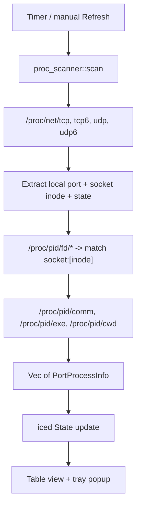

# PortMedic for Linux — Architecture

This documents the design approach for the Rust/Linux port. It is a plan
document as much as a description of what exists today; see the "Status"
section for what is actually implemented versus stubbed.

## Goals / non-goals

Same guiding principle as the macOS app: help a developer find and free a
busy development port, fast, without becoming a general process/network
monitor. Global shortcuts and code-signing-equivalent concerns are
explicitly deferred (see Roadmap in the main README).

## Why not reuse the Swift implementation

The macOS app depends on `lsof` (subprocess), AppKit, Carbon, and SwiftUI.
None of these exist on Linux. The UX/safety decisions transfer; the code
does not. This is a parallel implementation, not a port of the Swift source.

## Module layout

```
portmedic-linux/
  Cargo.toml
  src/
    main.rs             iced Application: State, Message, update, view, window identity
    branding.rs         Embedded PortMedic PNG decoded for window and tray icons
    model.rs             PortProcessInfo, TransportProtocol (mirrors PortProcessInfo.swift)
    proc_scanner.rs       /proc scanning -> Vec<PortProcessInfo>
    process_control.rs    PID-safety checks + SIGTERM/SIGKILL (mirrors SignalProcessTerminator.swift)
```

Planned additions as implementation proceeds:
- `framework_detect.rs` — port/name heuristics, mirrors `HeuristicFrameworkDetector.swift`.
- `watched_ports.rs` — persisted watchlist (JSON file under `~/.config/portmedic/`).
- `tray.rs` — system tray icon + popup, mirrors `MenuBarContentView.swift`.
- `quick_actions.rs` — copy PID/localhost URL, `xdg-open` for "open in browser".
- `assets/portmedic.png` — Linux desktop and application icon asset.
- `com.portmedic.PortMedic.desktop` — desktop launcher metadata.

## Data flow



## Port scanning approach

Direct `/proc` parsing instead of shelling out to `lsof`/`ss`/`netstat`:

1. Read `/proc/net/tcp`, `tcp6`, `udp`, `udp6`. Each line encodes local
   address:port (hex) and a socket inode.
2. Filter to listening/bound sockets (`TCP` state `0A` = `LISTEN`; UDP has
   no listen state, treat all bound as relevant).
3. Walk `/proc/<pid>/fd/*` for every PID under `/proc`, resolving symlinks;
   a target of the form `socket:[<inode>]` maps that inode to a PID.
4. Resolve process name via `/proc/<pid>/comm`, executable path via
   `readlink("/proc/<pid>/exe")`, working directory via
   `readlink("/proc/<pid>/cwd")`.

Rationale: not every distro ships `lsof`; parsing `/proc` has no external
binary dependency and avoids the shell-argument trust surface entirely
(same principle as `CommandRunner.swift`'s "absolute path + argument array,
never a shell string").

Caveat to document once implemented: reading another user's `/proc/<pid>/fd`
requires the same privilege boundary as the macOS app already documents —
without root, only your own processes are fully inspectable/killable.

## Process termination

`nix::sys::signal::kill` (a thin libc wrapper), never a `kill` subprocess.
`is_safe_target` rejects `pid <= 0`, `pid == 1` (init/systemd), and the
app's own PID — the exact rule set already reviewed and tested for
`SignalProcessTerminator.swift`. Flow: `SIGTERM` first; only after the user
confirms in a second dialog does the app send `SIGKILL`. No default
force-kill.

## UI approach

[iced](https://iced.rs), chosen over egui and GTK4-rs:
- Elm-architecture (`State`, `Message`, `update`, `view`) maps directly onto
  the existing `@Published` state / intent-method pattern from the SwiftUI
  ViewModels — same mental model, different syntax.
- One consistent look across GNOME/KDE/etc., rather than an inconsistent
  "native-on-GNOME-only" GTK4-rs experience.
- Tray icon via the `tray-icon` crate, mirroring `MenuBarExtra`.

## Desktop integration

The application uses `com.portmedic.PortMedic` as its Linux application ID so
the window manager can associate the running window with the desktop entry.
The window and tray both consume the embedded `assets/portmedic.png` asset.
Selecting **Show PortMedic** from the tray clears the dashboard sub-view,
unminimizes the existing window, and requests focus; it never opens a second
window.

For a source checkout, run `./scripts/install-desktop.sh` to install the
desktop entry and icon under the user's XDG data directory. A future package
format should install the same desktop entry and icon into system or package
XDG paths.

## Testing strategy

Pure-logic modules are unit tested without any Linux-specific I/O:
- `process_control::is_safe_target` — ports the exact
  `SignalProcessTerminatorTests` cases (PID 0, negative, 1, own PID,
  ordinary PID).
- `proc_scanner` parsing functions, once implemented, will be tested against
  fixed sample strings shaped like real `/proc/net/tcp` content — the same
  approach as `LsofOutputParserTests`, no real `/proc` access required.
- iced's `update` function is a pure reducer and is unit-testable without
  spinning up a window.

## Status

Experimental stage: the dashboard, `/proc` scanning, process controls, tray,
desktop icon, and tray-to-window focus flow are implemented. Packaging and
broader runtime coverage across Linux desktop environments remain future work.
